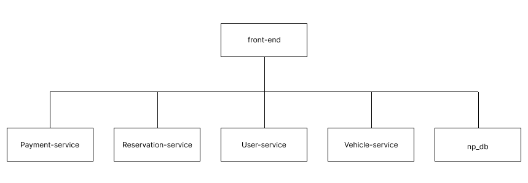

Design Considerations:

Each service focuses on a single domain:
User Service: Handles user registration, authentication, and rental history.
Vehicle Service: Manages vehicle details and availability.
Reservation Service: Handles reservations and calculates costs.
Payment Service: Manages payments and emails related to transactions.

All the services connect to one database for easier management.

Configured to allow cross-origin requests for front end integration.

Sensitive information like API keys (e.g., Stripe) is stored in environment variables to ensure security.

Each service listens on a dedicated port to avoid conflicts.

Architecture diagram:

Instructions to run:
1. Set up database-after running the sql in np_db.sql, in each main.go in each microservice update this line, dsn := "user:password@tcp(localhost:3306)/np_db"
2. Set environmental variable for payment: in the terminal/powershell by doing $env:STRIPE_API_KEY="sk_test_51QSOXHE4kxPn6gfJSMF4SSpbJBv9mRvFav8ePrgPrRONLYQFLDYS178QEZirawSIDzU5zP8DLDwiRIK3FunuG4Po00rSE7EfRx"
in power shell
3. you have to run each micro service individually so for each micro service create a new teminal and go to its directory before running go run main.go

To complete different functions for the requirements
1.User registration, login and edit profile
-run the index.html using F5
-click on register here
-enter all 3 items(you will only receive the registration verification email by doing this )
-click register then login using the details
-click on profile, edit profile and input the changes
-Do note if you are creating multiple users, phone number and email cannot be the same throughout the table
2.Vehicle reservation 
-add a start time and end time and click search vehicles
-click reserve 
-click confirm reservation to make a reservation.
-now if you input the same times again you will see that the vehicle you reserved is now not available

3.reservation completion editting and cancellation
-click on profile from the main page
-click view rental history
-click edit reservation,input a new start and end date to update it or you can cancel it by clicking cancel

-click complete reservation
-use 4242424242424242 as a dummy card number, date and CVV can be random numbers as well as zip code
-after you pay,go back to your rental history and you will see that the status is complete

4.membership benefits
 -return to the login page 
 login with email:vipUser@example.com password:vipuser
 -reserve a vehicle and you will see the total cost of the booking will be 25& off because its at the VIP tier

